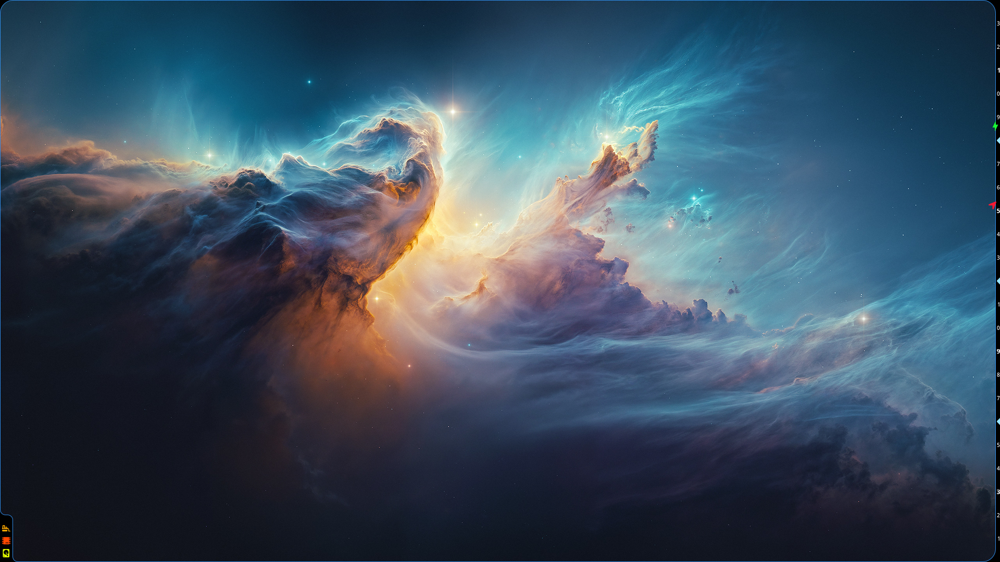
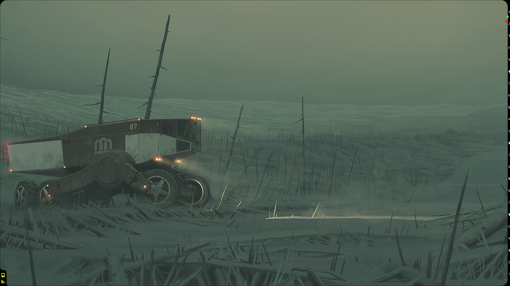
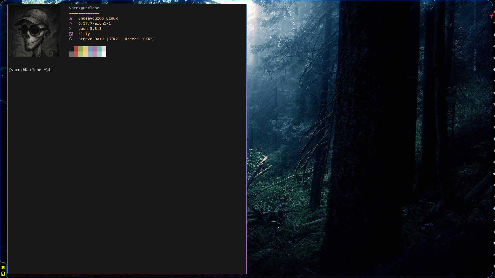
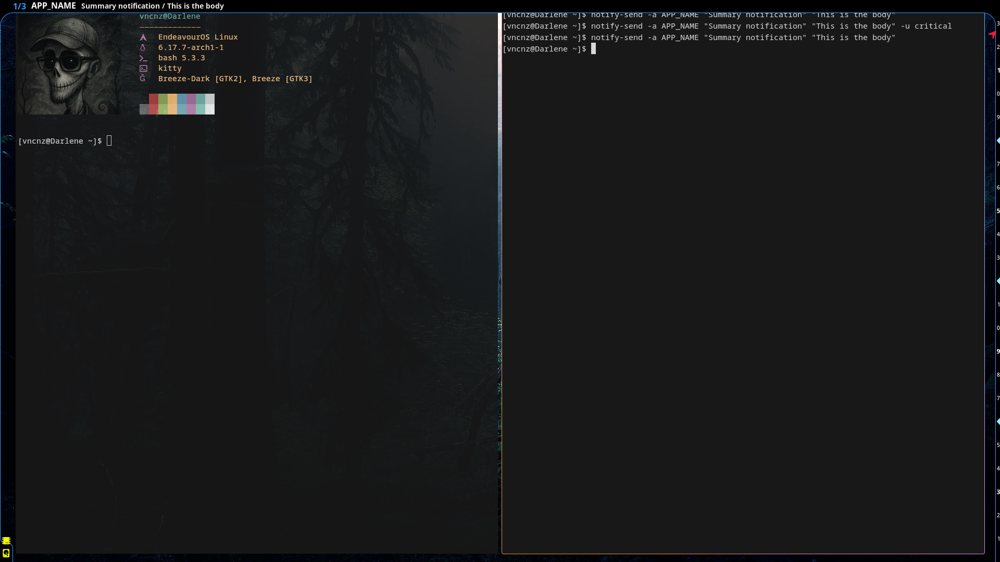
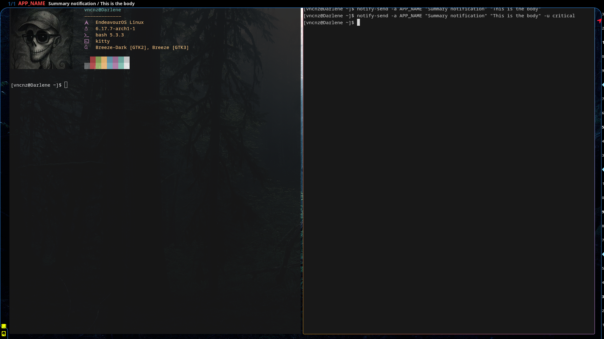

# heimdallr

## About the name

From wikipedia:

> In Norse mythology, Heimdall (from Old Norse Heimdallr; modern Icelandic Heimdallur) is a god. He is the son of Odin and nine sisters. Heimdall keeps watch for invaders and the onset of Ragnarök from his dwelling Himinbjörg, where the burning rainbow bridge Bifröst meets the sky. He is attested as possessing foreknowledge and keen senses, particularly eyesight and hearing.

## About this project

The aim of this project is to show several kinds of information:
- simulate rounded corners of the display
- show which resources are in a worrying state
- show current time
- show estimated time to full battery charge/discharge

After several experiments, I came up with this solution. Using a custom SVG shape, I rounded the screen corners. In the bottom-left corner, the frame reserves space for several icons, visible only when needed, indicating which resources are in a warning state (e.g. RAM almost full, low WLAN signal, and so on).

On the right side, there is a “linear clock” with an arrow indicating the current time. On the same clock, an icon shows the battery’s estimated time to full charge (a green bolt) or to full discharge (a red skull).

All this information takes virtually no useful space on the screen.

Resource data is retrieved via a Linux socket from another of my projects, called Ratatoskr, which is also available on GitHub.

Initially, I implemented this system using the Ignis framework (Python + GTK), but it was consuming about 176 MB of RAM. So I rewrote the UI in Rust, communicating directly with Wayland and avoiding the GTK toolkit. With this approach, memory usage dropped to approximately 34 MB on my laptop.
The impact on average load is around 0.01, so really small. I measured the impact on average load as the ratio between the time spent with the Heimdallr process in "Running" or "disk-sleep" status and the total measurement time.

---

Oh, if the screen looks too empty, that’s by design: I like minimalism. No status bar, Niri as WM, and this is my daily driver.

## Screenshots

Light blue border; battery charging; high RAM, medium load, and light disk usage alarms:



Light blue border; battery discharging; light disk usage alarm:


No battery charging/discharging; no resource alarms:


No border; battery charging; light disk usage alarm:


No border; battery charging; medium load and light disk usage alarms, with different wallpaper:


Light blue border; light memory pressure and light disk usage alarms, with different wallpaper and an open window:


## Configuration
You can configure frame color and clock presence with a json file in ```~/.config/heimdallr/config.json```:
```
{
    "frame_color": "red,green,blue,alpha" | "resources" | "random" | null,
    "show_clock": true | false
}
```

For example:
```
{
    "frame_color": "0.2,0.6,1.0,1.0",
    "show_clock": true
}
```

N.B. "resources" is not implemented yet.

## Notifications
Now, Heimdallr listen to notifications. When there is a notification, the upper section of the frame become thicker to accomodate the notification.
Only one notification can be shown at any given moment, on a single line of text, with the following format:

> 1/3 **[app_name]** &nbsp;&nbsp;&nbsp;[summary] / [body]

Normal notifications gets a timeout of 3 seconds, critical notifications lasts until eternity and beyond.

You can browse and remove notifications with following commands:
- echo hide_notification > /tmp/heimdallr_cmds
- echo prev_notification > /tmp/heimdallr_cmds
- echo next_notification > /tmp/heimdallr_cmds

You don't need to create /tmp/heimdallr_cmds file, it is created automatically by Heimdallr and it is a named pipe (aka a fifo special file): you write in it you command and it's all.

Notification example:


Another notification example, critical


## TODOs
- ~~Add a visual indicator for Ratatoskr disconnection~~ Done!
- Dynamic frame color (depending on resource icons)