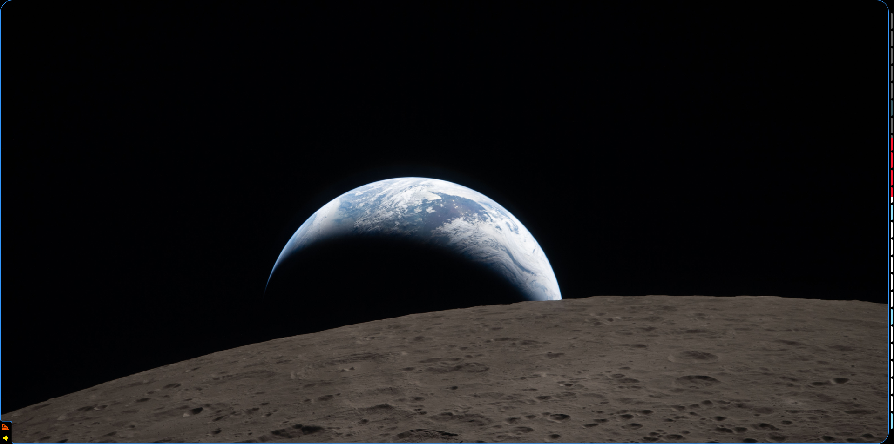
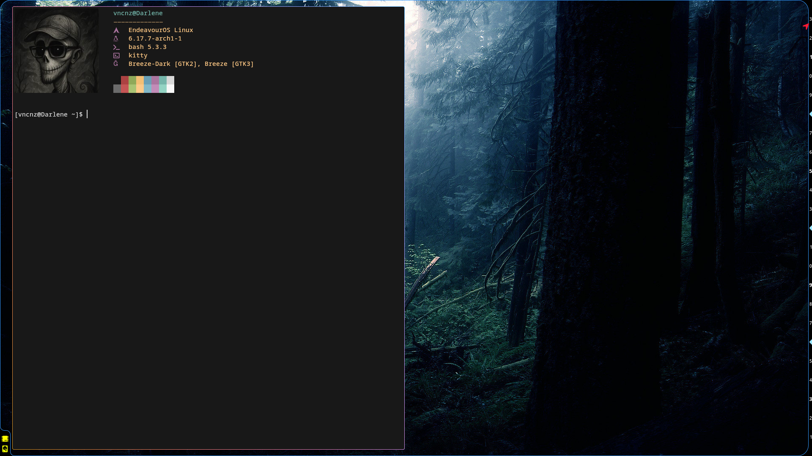
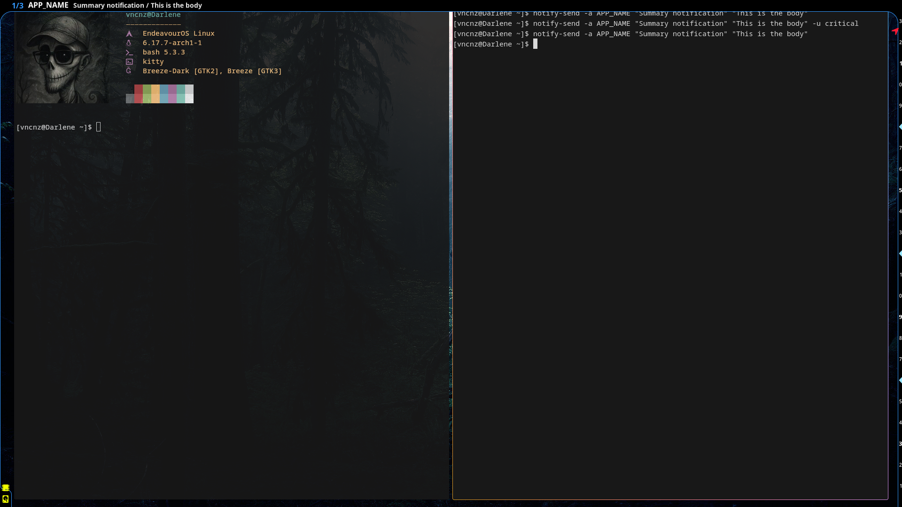
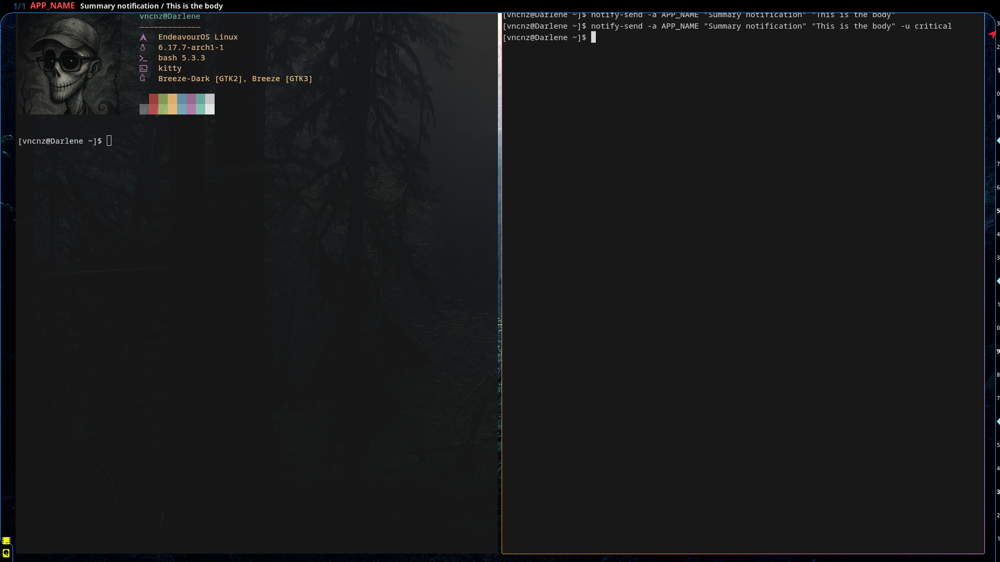
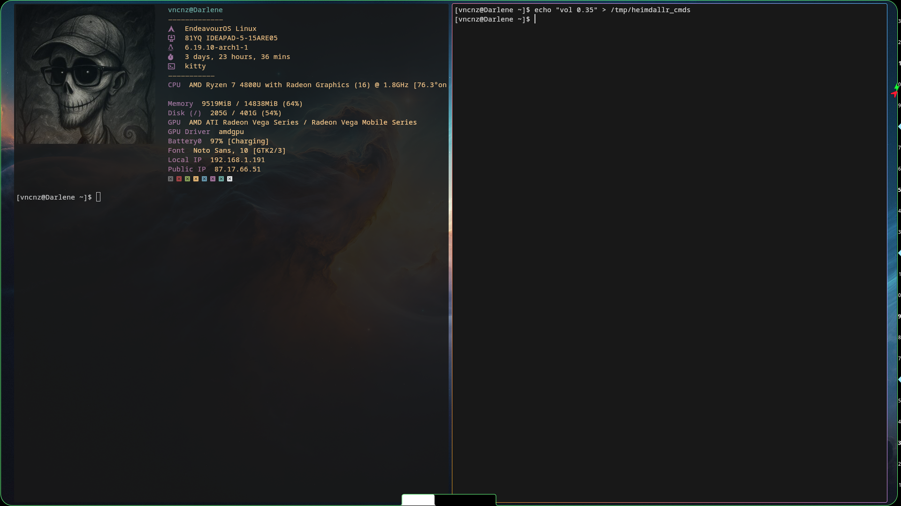

# heimdallr - ᚺᛖᛁᛗᛞᚨᛚᚱ

Heimdallr is a minimal Wayland overlay that shows system state only when it matters.
No bars, no noise — just timely information at the edge of your screen.

## About the name

From wikipedia:

> In Norse mythology, Heimdall (from Old Norse Heimdallr; modern Icelandic Heimdallur) is a god. He is the son of Odin and nine sisters. Heimdall keeps watch for invaders and the onset of Ragnarök from his dwelling Himinbjörg, where the burning rainbow bridge Bifröst meets the sky. He is attested as possessing foreknowledge and keen senses, particularly eyesight and hearing.

## About this project

The aim of this project is to show several kinds of information:

- simulate rounded corners of the display
- show which resources are in a worrying state
- show current time
- show estimated time to full battery charge/discharge
- show notifications

After several experiments, I came up with this solution. Using a custom SVG shape, I rounded the screen corners. In the bottom-left corner, the frame reserves space for several icons, visible only when needed, indicating which resources are in a warning state (e.g. RAM almost full, low WLAN signal, and so on).

On the right side, there is a “linear clock” with an arrow indicating the current time. On the same clock, an icon shows the battery’s estimated time to full charge (a green bolt) or to full discharge (a red skull).

All this information takes virtually no useful space on the screen.

Resource data is retrieved via a Linux socket from another of my projects, called Ratatoskr, which is also available on GitHub.

Initially, I implemented this system using the Ignis framework (Python + GTK), but it was consuming about 176 MB of RAM. So I rewrote the UI in Rust, communicating directly with Wayland and avoiding the GTK toolkit. With this approach, memory usage dropped to approximately 34 MB on my laptop.
The impact on average load is around 0.01, so really small. I measured the impact on average load as the ratio between the time spent with the Heimdallr process in "Running" or "disk-sleep" status and the total measurement time.

---

Oh, if the screen looks too empty, that’s by design: I like minimalism. No status bar, Niri as WM, and this is my daily driver.

## Screenshots

Clock1, light blue border; battery charging; high RAM, medium load, and light disk usage alarms:


Clock1, light blue border; battery discharging; light disk usage alarm:


Clock2, light blue border; light high volume alarm, with different wallpaper:


Clock1, no battery charging/discharging; no resource alarms:


Clock1, no border; battery charging; light disk usage alarm:


Clock1, no border; battery charging; medium load and light disk usage alarms, with different wallpaper:


Clock1, light blue border; light memory pressure and light disk usage alarms, with different wallpaper and an open window:


## Configuration

You can configure frame color and clock presence with a json file in ```~/.config/heimdallr/config.json```:

```json
{
    "frame_color": [red,green,blue,alpha] | "worst-resource" | "random" | null,
    "show_clock": "clock1" / "clock2" / null,
    "show_always_bluetooth": true / false
}
```

For example:

```json
{
    "frame_color": [0.2, 0.6, 1.0, 1.0],
    "show_clock": "clock1",
    "show_always_bluetooth": true
}
```

If you set "worst-resource" as frame_color, in absence of resource warnings the frame will have no border.
If you ser false as show_always_bluetooth, you'll see icons for your bluetooth peripherals only if their battery runs low.

## Notifications

Now, Heimdallr listen to notifications. When there is a notification, the upper section of the frame become thicker to accomodate the notification.
Only one notification can be shown at any given moment, on a single line of text, with the following format:

> 1/3 **[app_name]** &nbsp;&nbsp;&nbsp;[summary] / [body]

Normal notifications gets a timeout of 3 seconds, critical notifications lasts until eternity and beyond.

You can browse and remove notifications with following commands:

- echo hide_notification > /tmp/heimdallr_cmds
- echo prev_notification > /tmp/heimdallr_cmds
- echo next_notification > /tmp/heimdallr_cmds

You don't need to create /tmp/heimdallr_cmds file, it is created automatically by Heimdallr and it is a named pipe (aka a fifo special file): you write in it you command and it's all.

Notification example:


Another notification example, critical


## Wob-like indicator

Inspired by the [wob project](https://github.com/francma/wob), I implemented a generic indicator in Heimdallr. You can write to /tmp/heimdallr_cmds a decimal number between 0 and 1 and that number will be used to show an indicator in the bottom-center of the screen. The indicator slides in over 500 ms, remains visible for two seconds, and then slides out over 500 ms. Values outside the 0–1 range are clamped.

If no colored border is configured, the indicator uses a white background with 0.1 opacity to improve readability.

For example: ```echo "0.35" > /tmp/heimdallr_cmds```



## Clock styles

Now, Heimdallr offers two distinct clock styles to display the current time and the estimated battery charge/discharge time. Both clocks are positioned on the right edge of the screen, ensuring minimal intrusion while providing essential information at a glance.

### Available Styles

- **Clock1**: a sleek, minimalist design with a linear arrow indicating the current time. The battery status is represented by an icon (a green bolt for charging or a red skull for discharging) integrated into the clock’s layout. Hour numbers are shown to assist with quick time reading and markers are displayed as small triangles every 3 hours, with larger, blue triangles every 6 hours for easier orientation.
- **Clock2**: this clock consists of notches, each representing one hour; every 6 hours, a notch is highlighted in blue for better readability. The current time is indicated by a white (or blue) fill that progresses along the notches. Battery status and eta is shown as a colored fill (green for charging, red for discharging) that extends the time indicator.

You can choose between these styles, or disable the clock entirely, via the configuration file. This flexibility allows you to tailor Heimdallr’s appearance to your aesthetic preferences or functional needs.

**For Developers:** The clock system is built around the ClockTrait, making it easy to extend or create custom clock styles. Fork the project and experiment with your own designs!

## TODOs

- Optional ratatoskr:
  - Choose to show/hide icon of disconnection in config
  - Check battery status in Heimdallr if ratatoskr is disconnected?
- Publish on AUR
- Publish as Nix flake?
- Create a GIF?

### Improvements

- ~~Manage replacing logic for unmounting/unmounted notifications~~ Done!
- ~~Move logs to file and check why sometime heimdallr dies~~ Done!
- ~~Force embedded screen in laptops~~ Done!
- ~~Make buffer size depending on output size~~ Done!
- Put temporary notification always before important ones (because the latter doesn't expire!)
- Manage those situations where the "unmounted" notification arrives instants before the "mounting" notification
- ~~Reduce quantity of damaged surface (wl_surface.damage_buffer only for changed areas)~~ it's not worth it

### New functionalities

- ~~Add a visual indicator for Ratatoskr disconnection~~ Done!
- ~~Dynamic frame border color (depending on resource icons)~~ Done!
- ~~Add an alert icon for "reboot recommended" situation~~ Done!
- ~~Animation system?~~ Done!
- ~~Wob-like functionality~~ Done!
- Monitor and indicate mic/camera accesses
- Add output configuration both on config file and as parameter
- Show a resources resume for some time after receiving a dedicated command (something like [AVG 0.9 1.27 1.41] [MEM 73% / SWP 14%] [DSK 49%] and so on)?
- Force a red frame border when battery is low, regardless of the settings?
- Custom hooks for events?
- Plugin system?

## Known bugs

- ~~Sometimes heimdallr terminates itself after system suspension/resume~~ Normal behaviour, surface is destroyed by Wayland. Solution: set Heimdallr as a system service with automatic restart!
- ~~Sometimes, closing an urgent notifications doesn't restore normal frame width~~ Fixed!
- ~~Sometimes, a bluetooth device keeps to be shown after it is shut off~~ upower's behaviour (used by ratatoskr) when mouse is charging
