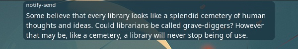
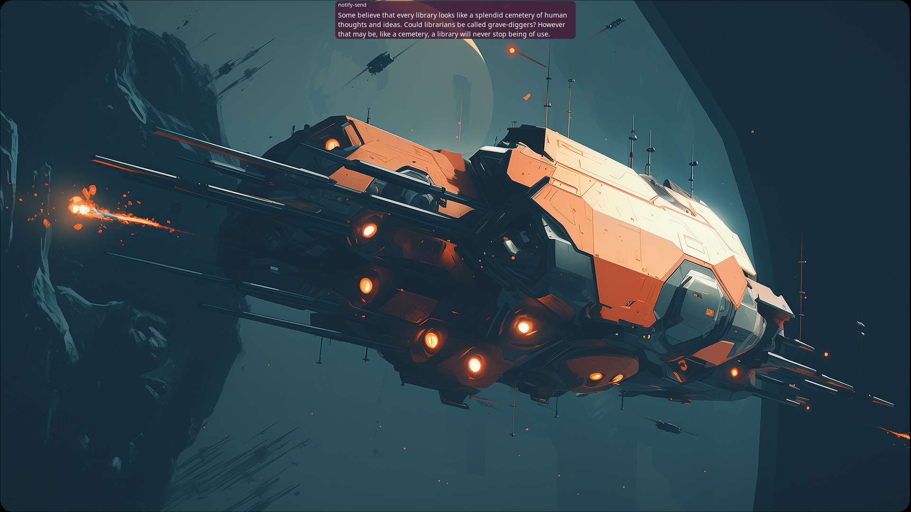

# heimdallr - ᚺᛖᛁᛗᛞᚨᛚᚱ

Heimdallr is an adaptive Wayland HUD that surfaces relevant information and lightweight controls without relying on permanent widgets.
A minimal morphing pill, no noise — just timely information floating on your screen.

## About the name

From wikipedia:

> In Norse mythology, Heimdall (from Old Norse Heimdallr; modern Icelandic Heimdallur) is a god. He is the son of Odin and nine sisters. Heimdall keeps watch for invaders and the onset of Ragnarök from his dwelling Himinbjörg, where the burning rainbow bridge Bifröst meets the sky. He is attested as possessing foreknowledge and keen senses, particularly eyesight and hearing.


## UI preview


In this demo:
- **Clock + battery status:** Displays the current time and battery charging state (including ETA).
- **Battery discharge:** Dynamically transitions to show discharging status and updated ETA.
- **Microphone indicator:** Automatically expands when Firefox accesses the audio input.
- **Level indicator:** Demonstrates a wob-like overlay, ideal for real-time volume or brightness adjustments.
- **Timer & stopwatch:** A 3-second countdown triggers, hits zero, and seamlessly switches to tracking elapsed time once completed.
- **System notification:** Displays an incoming desktop notification with dynamic resizing.
- **Resource warning:** Displays an alert icon when high system temperature is detected.

## About this project

The aim of this project is to show several kinds of information:

- simulate rounded corners of the display
- show which resources are in a worrying state
- show current time
- show estimated time to full battery charge/discharge
- show notifications

After several experiments, I came up with this solution. Using a custom SVG shape, I rounded the screen corners. Inside the pill, every functionality can show its data if needed.

The clock is a constant presence, the only one for most of the time.

The second element is an indicator for the battery if you are using a laptop. An icon and a text show the battery’s estimated time to full charge (next to a green bolt) or to full discharge (next to a red skull)

One or more dedicated warning icons appear dynamically only when system resources require attention (e.g., high temperature, low WLAN signal, or low battery). No icons are shown when there are no alarms.

Over the time, more and more features were added.

Resource data (such as CPU, RAM, and disk usage) is retrieved via a Unix socket from another of my projects, Ratatoskr, which is also available on [GitHub](https://github.com/vncnz/ratatoskr).

Ratatoskr is optional: if you choose not to run it, Heimdallr will not display resource warnings (e.g., high CPU/RAM usage).

Battery status, level, and estimated time remaining are collected by Heimdallr itself, so you will always have access to this information.

Initially, I implemented the previous version of UI using the Ignis framework (Python + GTK), but it was consuming about 176 MB of RAM. So I rewrote the UI in Rust, communicating directly with Wayland and avoiding the GTK toolkit. With this approach, memory usage dropped to approximately 34 MB on my laptop. Now, adding new functionalities, memory usage is 43 MB.
The impact on average load is around 0.01, so really small. I measured the impact on average load as the ratio between the time spent with the Heimdallr process in "Running" or "disk-sleep" status and the total measurement time.

---

Oh, if the screen looks too empty, that’s by design: I like minimalism. No (full) status bar, Niri as WM, and this is my daily driver.

## Screenshots

Full screen, clock, battery charging:


Usual state (just the clock):


Battery discharging; low RAM alarm:


Battery charging; medium network alarm:


Battery discharging; very high RAM alarm:


Battery charging; several alarms:


Battery charging; several alarms (more):


Battery discharging, with power:


## Configuration

You can configure frame color and clock presence with a json file in ```~/.config/heimdallr/config.json```:

```js
{
    "frame_color": [red,green,blue,alpha] | "worst-resource" | "random" | null,
    // "show_clock": "clock1" / "clock2" / null, // Deprecated in pill-ui
    // "show_always_bluetooth": true / false, // Deprecated in pill-ui
    "hide_missing_ratatoskr": true / false,
    "show_watts": true / false,
    "show_devices_battery_max_level": number
}
```

For example:

```js
{
    "frame_color": [0.2, 0.6, 1.0, 1.0],
    // "show_clock": "clock1",
    // "show_always_bluetooth": true,
    "hide_missing_ratatoskr": true,
    "show_watts": true,
    "show_devices_battery_max_level": 60
}
```

- `frame_color`: Accepts RGBA color values or `"worst-resource"`. When set to `"worst-resource"`, the frame border dynamically reflects system status warnings and stays hidden when everything is running normally.

- `hide_missing_ratatoskr`: Set to `true` to hide the warning icon when Ratatoskr is disconnected (making Ratatoskr optional).

- `show_watts`: Set to `true` to show the power flow (in Watts, rounded to the nearest integer) alongside the battery ETA during charging and discharging.

- `show_devices_battery_max_level`: Threshold for displaying connected external devices (such as Bluetooth mice, headsets, or wired phones). A device icon appears only if its battery level is at or below this percentage. Set to `100` or higher to keep all devices visible continuously.

Default values are the following:

```js
{
    "frame_color": null,
    // "show_clock": null,
    // "show_always_bluetooth": true,
    "show_devices_battery_max_level": 80,
    "hide_missing_ratatoskr": false,
    "show_watts": false
}
```

## Notifications

Now, Heimdallr listen to notifications. When there is a notification, the pill changes its size to accomodate the notification.
Only one notification can be shown at any given moment, on several lines if needed, with the following format:

> **[app_name]**
>
> [body if not empty, summary otherwise]

Normal notifications gets a timeout of 3 seconds, critical notifications lasts until eternity and beyond.

You can ~~browse and~~ remove notifications with following command~~s~~:

- echo hide_notification > /tmp/heimdallr_cmds
- ~~echo prev_notification > /tmp/heimdallr_cmds~~ // Deprecated in pill UI
- ~~echo next_notification > /tmp/heimdallr_cmds~~ // Deprecated in pill UI

You don't need to create /tmp/heimdallr_cmds file, it is created automatically by Heimdallr and it is a named pipe (aka a fifo special file): you write in it your command and it's all.

Notifications are queued with the following logic:

new notification urgency|pill current state|action
-----------------|------------------|-------
normal|idle|show the new notification
normal|showing normal notification|replace the current notification and reset timer
critical|showing normal notification|replace the current notification, no timeout
critical|showing critical notification|put the new notification in the queue
normal|showing critical notification|ignore new notification

Notification example:



Another notification example, critical



## Wob-like indicator

Inspired by the [wob project](https://github.com/francma/wob), I implemented a generic indicator in Heimdallr. You can write to /tmp/heimdallr_cmds a decimal number between 0 and 1 and that number will be used to show an indicator in the pill background. The indicator fade in over 500 ms, remains visible for two seconds, and then fades out over 500 ms. Values outside the 0–1 range are clamped.

For example: ```echo "0.35" > /tmp/heimdallr_cmds```


## ~~Clock styles~~

~~Now, Heimdallr offers two distinct clock styles to display the current time and the estimated battery charge/discharge time. Both clocks are positioned on the right edge of the screen, ensuring minimal intrusion while providing essential information at a glance.~~

### ~~Available Styles~~

- ~~**Clock1**: a sleek, minimalist design with a linear arrow indicating the current time. The battery status is represented by an icon (a green bolt for charging or a red skull for discharging) integrated into the clock’s layout. Hour numbers are shown to assist with quick time reading and markers are displayed as small triangles every 3 hours, with larger, blue triangles every 6 hours for easier orientation.~~
- ~~**Clock2**: this clock consists of notches, each representing one hour; every 6 hours, a notch is highlighted in blue for better readability. The current time is indicated by a white (or blue) fill that progresses along the notches. Battery status and eta is shown as a colored fill (green for charging, red for discharging) that extends the time indicator.~~

~~You can choose between these styles, or disable the clock entirely, via the configuration file. This flexibility allows you to tailor Heimdallr’s appearance to your aesthetic preferences or functional needs.~~

~~**For Developers:** The clock system is built around the ClockTrait, making it easy to extend or create custom clock styles. Fork the project and experiment with your own designs!~~

## Security warning feature

Heimdallr includes a lightweight, hardware-aware privacy monitor for microphones and cameras. Rather than relying solely on desktop notifications, it independently verifies when capture devices are actually in use by correlating PipeWire sessions with kernel-reported device activity.

### Why

While many laptops have a hardware-wired LED for the camera, most microphones have no physical indicator. Furthermore, sophisticated software can sometimes bypass firmware-controlled LEDs. Heimdallr acts as your digital "status light" for these peripherals.

Most software indicators only show what the sound server (PipeWire/PulseAudio) reports. Heimdallr can detect applications that access capture devices directly through ALSA or V4L2, even when they bypass PipeWire.

Instead of trusting a single software layer, Heimdallr independently verifies device activity from multiple sources.

### How

Heimdallr monitors the runtime state of audio devices through /proc/asound together with accesses to microphone and camera device nodes under /dev, correlating this low-level information with PipeWire sessions.

## Timer

Heimdallr got a new countdown functionality. Timer is set sending a new command with a string `timer` followed by desired time in format XXmYYs, for example:

```bash
echo "timer 10s" > /tmp/heimdallr_cmds
echo "timer 1m30s" > /tmp/heimdallr_cmds
echo "timer 15m" > /tmp/heimdallr_cmds
```

You can remove the timer with the command `timer off`:

```bash
echo "timer off" > /tmp/heimdallr_cmds
```

For your convenience, you can declare a function in your .bashrc like the following:

```bash
tm() {
    echo "timer $1" > /tmp/heimdallr_cmds
}
```

With this shortcut, you can set/remove a timer typing in your terminal just this:

```bash
tm 10s
tm 1m30s
tm off
```

When a timer is active, Heimdallr updates the UI at least once a second.

The timer icon-and-text starts green and gradually shifts to yellow as it nears expiration. Once the timer expires, the background turns red, and the displayed value starts counting up (indicating how much time has passed since the deadline).


## Stopwatch

You can set the "timer" in stopwatch mode using the command `timer up`. Time starts from zero and move forward, like when the timer is expired but the icon remains green. Like in timer mode, you can remove the timer/stopwatch with the command `timer off`.

## External batteries

Heimdallr displays a list of all devices detected by upower: for example, your mouse connected through bluetooth or your phone that is charging through an usb; you can see the latter example in the following screenshot.

Used icon is based on device type and, for several types, bluetooth or wired connection: mouse (bt/wired), phone (bt/wired), tablet, remote controller, speakers, headphones, gamepads, keyboard, other (bt/wired).


## TODOs

- ~~Optional ratatoskr:~~ Done!
  - ~~Choose to show/hide icon of disconnection in config~~ Done!
  - ~~Check battery status in Heimdallr~~ Done!
- Publish on AUR
- Publish as Nix flake?
- Create a GIF?

### Improvements

- ~~Manage replacing logic for unmounting/unmounted notifications~~ Done!
- ~~Move logs to file and check why sometime heimdallr dies~~ Done!
- ~~Force embedded screen in laptops~~ Done!
- ~~Make buffer size depending on output size~~ Done!
- ~~(UI) Different UI for the batteries of the devices?~~ (sorta) done!
- ~~(performance) Send battery signal only if something is changed~~ Done!
- (robustness) Check devices on system resume?
- ~~(code) Evaluate a modular system in which each component keeps a cache and private info~~ Done with new pill UI
- ~~(UX) Put temporary notification always before important ones (because the latter doesn't expire!)~~ Done!
- ~~Reduce quantity of damaged surface (wl_surface.damage_buffer only for changed areas)~~ it's not worth it
- ~~Make external batteries information optional~~ Done!
- ~~Implement a queue logic for notifications~~ Done!
- ~~Add pause/unpause to timeout~~ Done!


### New functionalities

- ~~Add a visual indicator for Ratatoskr disconnection~~ Done!
- ~~Dynamic frame border color (depending on resource icons)~~ Done!
- ~~Add an alert icon for "reboot recommended" situation~~ Done!
- ~~Animation system?~~ Done!
- ~~Wob-like functionality~~ Done!
- ~~Monitor and indicate mic/camera accesses~~ Done!
- ~~Countdown~~ Done!
- Add output configuration both on config file and as parameter
- Show a resources resume for some time after receiving a dedicated command (something like [AVG 0.9 1.27 1.41] [MEM 73% / SWP 14%] [DSK 49%] and so on)?
- Force a red frame border when battery is low, regardless of the settings?
- Custom hooks for events?
- Plugin system?
- Show again last notification on cmd retrieving?
- Autohide clock?
- wob-like functionality: add color or warning (with automatic color selection) in cmd

## Known bugs

- ~~Sometimes heimdallr terminates itself after system suspension/resume~~ Fixed!
- ~~Sometimes, closing an urgent notifications doesn't restore normal frame width~~ Fixed!
- Changing volume disabling mute, the added icon is out of bounds because the width doesn't change
